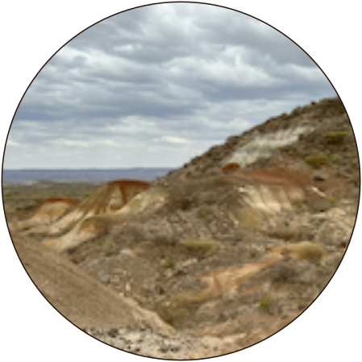

::: {layout="[ 30, 70 ]"}
::: {#headshot}
\
\
\
\
{fig-alt="Headshot with the Brooklyn Bridge"}
:::

::: {#bio}
## Deep time perspectives on human–environment connections 

I am interested in applying paleoclimatological methods to questions about environmental history during the earliest stages of hominin evolution in the Miocene and in the context of human cultural development through the Holocene. I am currently a Postdoctoral Fellow in [The Earth Commons at Georgetown University](https://earthcommons.georgetown.edu/research/eco-fellows/).  

My previous work has used stable isotope geochemistry of waters and carbonate rocks to better understand environmental processes in the Turkana Basin, northern Kenya, where primate fossils and contemporary basin hydrology represent millions of years of adaptation to changes on the landscape. Projects I am actively growing are focused on synthesizing climate proxy records of extreme events in North America with archaeological and historical archives.  

Climate history repeats itself, and past analogues inform forward modeling and our understanding of human relationships with environments and climates. My research aims to illuminate the connections between people and the planet, with a 20 million years-long view. 

:::
:::

```{css, echo = FALSE}
h3{
    text-align: center;
    display: inline-flex;
    position: relative;}
    
figcaption{    
    text-align: center;
    margin: auto;}
```

::: {layout="[ 33, 33, 33 ]"}
::: {#water}
### Stable Isotope Hydrology
 and [Oregon, USA](https://doi.org/10.22541/essoar.168926403.34465563/v1)](images/schematic-circle.png){fig-alt="schematic diagram showing lake water, wind, raindrops, clouds, and a thermometer" fig-align="center"}
:::

::: {#pedcarbs}
### Soil Carbonate Geochemistry
{fig-alt="as SEM image of a soil carbonate sample with spots highlighted" fig-align="center"} 
:::

::: {#Miocene}
### Miocene Paleoclimate
{fig-alt="a landscape photo from the Turkana Basin showing red paleosol units on sandstone hills" fig-align="center"}
:::
:::